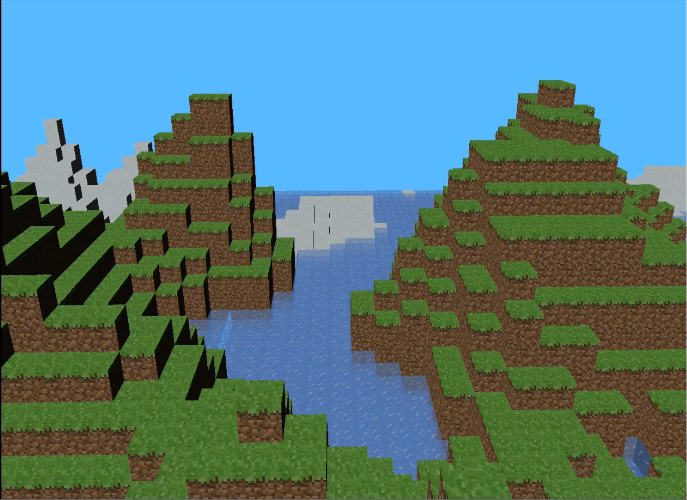

<!--
### Hi there 👋

  

**TODO: copy images to this repo**

**kaan9/kaan9** is a ✨ _special_ ✨ repository because its `README.md` (this file) appears on your GitHub profile.

Here are some ideas to get you started:

- 🔭 I’m currently working on ...
- 🌱 I’m currently learning ...
- 👯 I’m looking to collaborate on ...
- 🤔 I’m looking for help with ...
- 💬 Ask me about ...
- 📫 How to reach me: ...
- ⚡ Fun fact: ...
-->

  &nbsp;
  &nbsp;
  &nbsp;
  &nbsp;
  &nbsp;
  &nbsp;
  &nbsp;
  &nbsp;
  &nbsp;
  &nbsp;
  &nbsp;

## Projects

## [cuFLAVR - Neural Network Frame Interpolation on the GPU](https://github.com/adityahota/CIS565-Final-Project-SlowMo)
`C++` `CUDA` `cuDNN` `Python` `PyTorch`    
An implementation of the neural-network flow-agnostic frame-interpolation architecture [FLAVR](https://tarun005.github.io/FLAVR/) using CUDA and cuDNN.
This project implements the decoder stage of the architecture using cuDNN and combines it with an encoder
adapted from the reference FLAVR implementation in Python and PyTorch. This is a 3-person team project.  

**Original (30 FPS)** 
  
**2x interpolated (30 FPS)** 
  
<!--   
   -->

## [CUDA Path Tracer](https://github.com/kaan9/Project3-CUDA-Path-Tracer)
`C++` `CUDA` `Vulkan`    
A path-tracer based on [_Physically Based Rendering_](https://www.pbr-book.org/) implemented using CUDA.
Features include BSDF diffuse, specular, and refractive surfaces; Fresnel effects; depth-of-field; arbitrary OBJ mesh
loading; stream compaction on terminated rays; caching first bounces; and stochastic-sampled antialiasing.
Conversion from OpenGL to Vulkan is a work-in-progress. This is a [CIS 565](https://cis565-fall-2021.github.io/) project.  

**Simulated with 5000 iterations:**  
  

## [WebGL Forward+ and Clustered Deferred Shading](https://github.com/kaan9/Project5-WebGL-Forward-Plus-and-Clustered-Deferred)
`JavaScript` `WebGL`    
Simulation of a scene with a large number of light sources using different methods of rendering light:
Forward Rendering, Forward+ Rendering, and Clustered Deferred Rendering. Also features Blinn-Phong shading. This is a [CIS 565](https://cis565-fall-2021.github.io/) project. 
[**Try the Live Demo**](https://www.kaan9.com/Project5-WebGL-Forward-Plus-and-Clustered-Deferred/).
Tested on Google Chrome, requires WebGL extensions enabled by default on Chrome.  

  

## [CUDA Boid Flocking Simulator](https://github.com/kaan9/Project1-CUDA-Flocking)
`C++` `CUDA`    
Implementation of the [Reynolds boid algorithm](http://www.vergenet.net/~conrad/boids/pseudocode.html) using
CUDA. This is a [CIS 565](https://cis565-fall-2021.github.io/) project.  

**10000 boids simulated**  
  

## [CUDA Scan, Stream Compaction, Radix Sort](https://github.com/kaan9/Project2-Stream-Compaction)
`C++` `CUDA`    
Parallel scan and stream compaction implemented with CUDA. Also includes a radix sort implementation that can outperform std::sort for large arrays and a novel work-in-progress parallel UTF-8 decoder/encoder in CUDA. This is a [CIS 565](https://cis565-fall-2021.github.io/) project.  

## Mini-Minecraft
`C++` `OpenGL` `Qt`    
A Minecraft-like game. This is a 3-person team final project for [CIS 460](https://www.cis.upenn.edu/~cis460/current/). I implemented efficient multithreaded terrain generation using pthreads, chunk rendering, swimming, and biomes.  

## [x86lite Assembler and Interpreter](https://github.com/kaan9/x86lite-simulator)
`OCaml` `x86_64`     
Interpreter for a subset of x86. Assembles [a subset of x86_64](https://www.cis.upenn.edu/~cis341/current/hw2/doc/x86lite.html) to a pseudo-binary representation 
and interprets it. The included sample x86lite program is an implementation of left-reduce in assembly.
This is a project for [CIS 341](https://www.cis.upenn.edu/~cis341/current/).   

<!--
## LLVMlite Compiler
`OCaml` `LLVM IR` `x86_64`   
Compiiler from a subset of LLVM (as specified in [LLVMlite spec](https://www.cis.upenn.edu/~cis341/current/hw3/llvmlite.html)) to a subset of x86_64 (as specified in
[x86lite spec](https://www.cis.upenn.edu/~cis341/current/hw2/doc/x86lite.html)). This is a project for [CIS 341](https://www.cis.upenn.edu/~cis341/current/).
-->

## Superscalar Pipelined RISC CPU
`Verilog`    
5-stage pipelined dual-channel CPU for [a RISC architecture](https://www.cis.upenn.edu/~cis571/current/lc4_isa_sheet.pdf).
This is a 2-person team project for [CIS571](https://www.cis.upenn.edu/~cis571/current/).
 

## [Turkish Morphology](https://github.com/kaan9/turkish-morphology)
`Go`    
Algorithms implementing features of Turkish Morphology. Currently consists of a package inflection that performs agglutination on a root followed by a series of suffixes, respecting Turkish phonotactical rules. E.g.  

`avrupa lI lAş DIr AmA DIK lAr (I)mIz DAn (y)mIş sInIz` $\rightarrow$ `avrupalılaştıramadıklarımızdanmışsınız`

## [Shell](https://github.com/kaan9/sh)
`C`    
Implementation of a subset of the Unix Shell with support for job control. Supports redirection, pipes, background processes, job control with the commands `jobs`, `fg`, `bg`; and relays signals to child processes.

## [J Compiler](https://github.com/kaan9/j-compiler)
`C`    
Compiler for J, a Forth-like language, targeting a 16-bit [RISC architecture assembly](https://www.cis.upenn.edu/~cis571/current/lc4_isa_sheet.pdf).

<!--
## [LC4 Interpreter](TODO)
`C`    
TODO: Interpreter for a 16-bit [RISC architecture](https://www.cis.upenn.edu/~cis571/current/lc4_isa_sheet.pdf). CIS 240 Project
-->

## [Go](https://github.com/kaan9/Go)
`Java`    
GUI implementation of the Go board game in Java using Swing.  

## [CdSS](https://github.com/UYasher/CdSS)
`Python` `CSS` `OR-Tools`    
CSS with optional variable constraints. This project implements a transpiler from a superset of CSS that includes variables
and constraint programming to plain CSS using Google's OR-Tools. This is a 2-person team final project for [CIS 189](https://www.cis.upenn.edu/~cis189/).  

## [Malbolge VM](https://github.com/kaan9/malbolge-vm)
`C`    
An interpreter for the Malbolge esoteric programming language written in ANSI C.
Malbolge is a language designed to be extremely difficult to program in.
 

